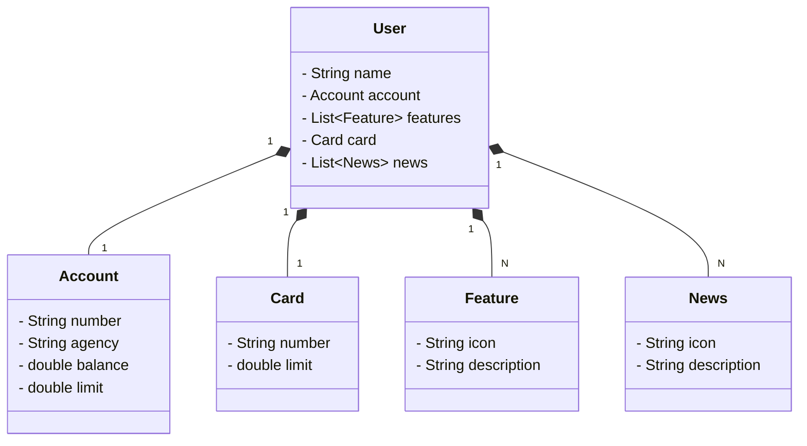

# Bradesco Java Cloud Native

## Diagrama de Classes




# Descrição

Desafio do Bootcamp da [DIO](https://www.dio.me/) para construção de uma API RESTful utilizando Spring Boot, com deploy na Railway e documentação via Swagger.

## 🚀 Tecnologias Utilizadas

- Java 17
- Spring Boot 3.4
- Spring Data JPA
- PostgreSQL (Railway)
- Swagger / OpenAPI
- Maven
- Docker (opcional para dev)
- Railway (deploy)

## 📦 Como rodar localmente

### Pré-requisitos

- Java 17
- Maven
- PostgreSQL (local ou em nuvem)
- IDE (VSCode, IntelliJ, etc.)

### Clone o projeto

```bash
git clone https://github.com/bruno-takeo/bradesco-java-cloud-native.git
cd bradesco-java-cloud-native

